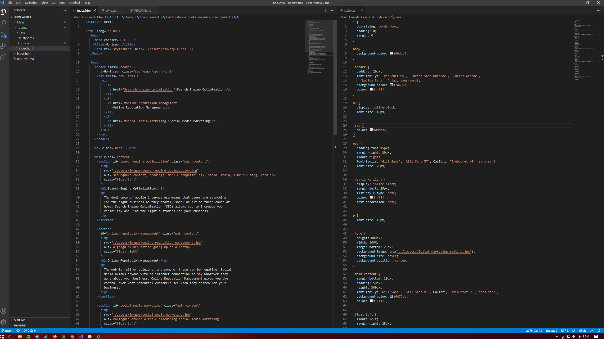

# <Homework-1-Horiseon>

## Description
Provide a short description explaining the what, why, and how of your project. Use the following questions as a guide:
- Homework 1 is it test and see if I can fix the given html and css code to be more efficent with the knowledge I have near the end of week 1 of the bootcamp. This also includes uploading the finished project to github and making it live. 
- I have learned alot through this assignment. Working slowly and carefully was the key to this assignment. I had to back track many times to see if the code that I added in would make or break the site. I was very rewarding to see everything come together and finally work, makes the time spent worth it.

## Installation
What are the steps required to install your project? Provide a step-by-step description of how to get the development environment running.
## Usage
    ```md
    
    ```md
    
    What the Horieon site should look like Before, and After.
    ```md
    
    Carefully find ways to condense the css and also add semantic elements to html.

## License
MIT License

Copyright (c) [year] [fullname]

Permission is hereby granted, free of charge, to any person obtaining a copy
of this software and associated documentation files (the "Software"), to deal
in the Software without restriction, including without limitation the rights
to use, copy, modify, merge, publish, distribute, sublicense, and/or sell
copies of the Software, and to permit persons to whom the Software is
furnished to do so, subject to the following conditions:

The above copyright notice and this permission notice shall be included in all
copies or substantial portions of the Software.

THE SOFTWARE IS PROVIDED "AS IS", WITHOUT WARRANTY OF ANY KIND, EXPRESS OR
IMPLIED, INCLUDING BUT NOT LIMITED TO THE WARRANTIES OF MERCHANTABILITY,
FITNESS FOR A PARTICULAR PURPOSE AND NONINFRINGEMENT. IN NO EVENT SHALL THE
AUTHORS OR COPYRIGHT HOLDERS BE LIABLE FOR ANY CLAIM, DAMAGES OR OTHER
LIABILITY, WHETHER IN AN ACTION OF CONTRACT, TORT OR OTHERWISE, ARISING FROM,
OUT OF OR IN CONNECTION WITH THE SOFTWARE OR THE USE OR OTHER DEALINGS IN THE
SOFTWARE.
---
## Features
-Clicking Navigation tabs will bring the user to the corresponding sections.
